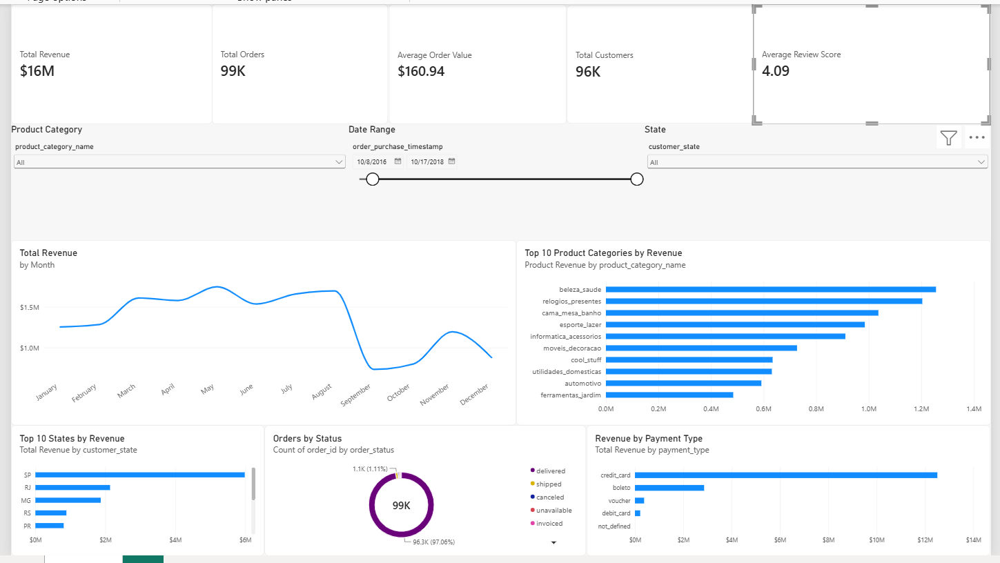

# E-Commerce Sales Dashboard | Power BI

## Overview

This project presents an interactive Power BI dashboard designed to analyze e-commerce sales performance. The dashboard transforms transactional data into clear business insights across revenue, orders, customers, product categories, geographic markets, payment methods, and order status.

## Dashboard



## Key Metrics

- Total Revenue: ~$16M
- Total Orders: ~99K
- Total Customers: ~96K
- Average Order Value: ~$160.94
- Average Review Score: 4.09

## Dashboard Features

- Monthly revenue trend analysis
- Top 10 product categories by revenue
- Top 10 states by revenue
- Revenue breakdown by payment type
- Order status distribution
- Interactive filtering by product category, date range, and state

## Key Insights

- Revenue reached its strongest levels during the middle of the year before declining sharply in September.
- `beleza_saude` (Health & Beauty) was the highest-revenue product category in the dashboard.
- SP (São Paulo) generated substantially more revenue than other states.
- Credit card was the dominant payment method.
- Approximately 97% of orders shown in the dashboard were delivered.

## Tools & Skills

- Power BI
- DAX
- Data Modeling
- Data Visualization
- KPI Development
- Business Intelligence
- Exploratory Data Analysis

## DAX Measures

Key measures created for the dashboard include:

```DAX
Total Revenue =
SUM('public payments'[payment_value])
